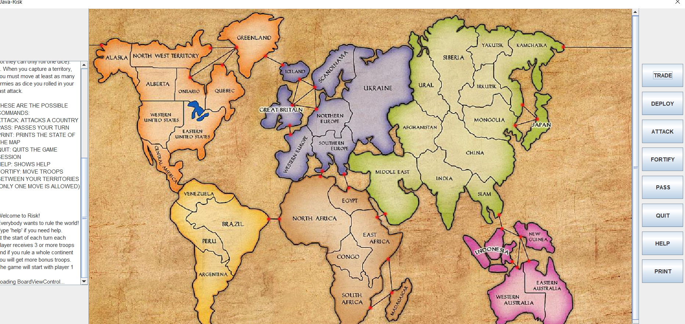

# RISK

------------------------------------------------------------------------
This is the project README file. Here, you should describe your project.
Tell the reader (someone who does not know anything about this project)
all he/she needs to know. The comments should usually include at least:
------------------------------------------------------------------------

* PROJECT TITLE: RISK
* VERSION or DATE: DEC 09, 2020
* AUTHORS: Mo'men Mushtaha
* PURPOSE OF PROJECT: Implementation of Classic Risk board Game

