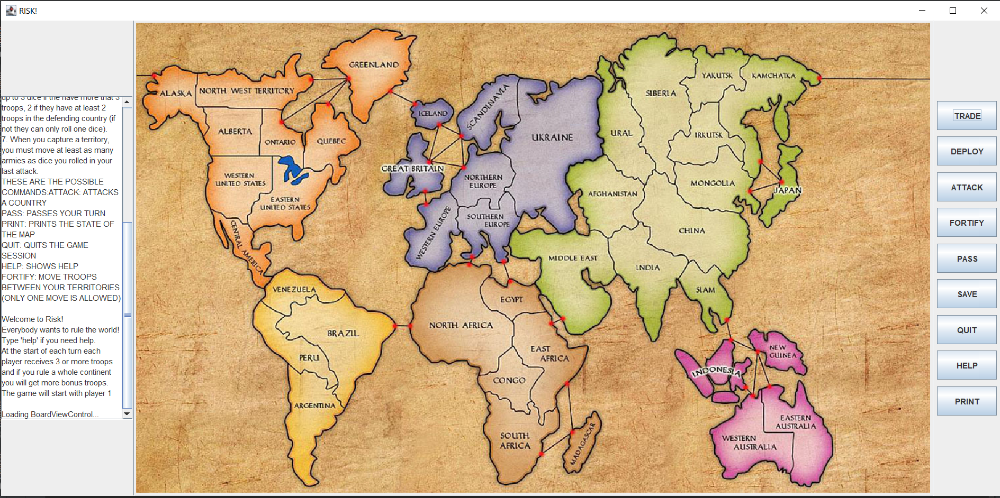

# RISK

------------------------------------------------------------------------
This is the project README file. Here, you should describe your project.
Tell the reader (someone who does not know anything about this project)
all he/she needs to know. The comments should usually include at least:
------------------------------------------------------------------------

* PROJECT TITLE: RISK
* VERSION or DATE: DEC 09, 2020
* AUTHORS: Mo'men Mushtaha
* PURPOSE OF PROJECT: Implementation of Classic Risk board Game

# RISK

## Description
The 'RISK' project is a strategic board game simulation based on the classic game of Risk. This project simulates the gameplay of Risk, where players aim to conquer territories and dominate the world through strategy, alliances, and battles.

## Key Features
- **Gameplay Mechanics:** Implements the core mechanics of Risk, including territory acquisition, troop deployment, and combat resolution.
- **Player Interaction:** Supports multiple players, either human or AI, with functionalities for forming alliances and negotiating.
- **Game Phases:** Simulates different phases of the game such as reinforcement, attack, and fortification.
- **AI Players:** Includes AI opponents with varying levels of difficulty to challenge players.
- **User Interface:** Provides a graphical user interface to visualize the game board, player movements, and combat outcomes.

## Technologies Used
- **Programming Language:** Java
- **GUI Framework:** JavaFX
- **Game Logic:** Custom-built using Java for game mechanics and rules

## Installation and Setup
1. **Clone the repository:**
   \`\`\`sh
   git clone https://github.com/MomenMushtaha/RISK.git
   \`\`\`
2. **Navigate to the project directory:**
   \`\`\`sh
   cd RISK
   \`\`\`
3. **Compile the Java files:**
   \`\`\`sh
   javac -d bin src/*.java
   \`\`\`
4. **Run the game:**
   \`\`\`sh
   java -cp bin Main
   \`\`\`

## Usage
- **Starting a New Game:** Use the GUI to set up a new game, configure player settings, and start playing.
- **Game Controls:** Interact with the game board through the GUI to deploy troops, attack territories, and move forces.
- **AI Difficulty:** Choose the difficulty level of AI opponents before starting the game.

## Contributing
Contributions are welcome! Please fork the repository and submit a pull request with your changes. Ensure that your code follows the project's style guidelines and includes appropriate documentation.

## License
This project is licensed under the MIT License. See the [LICENSE](https://github.com/MomenMushtaha/RISK/blob/main/LICENSE) file for more details.
